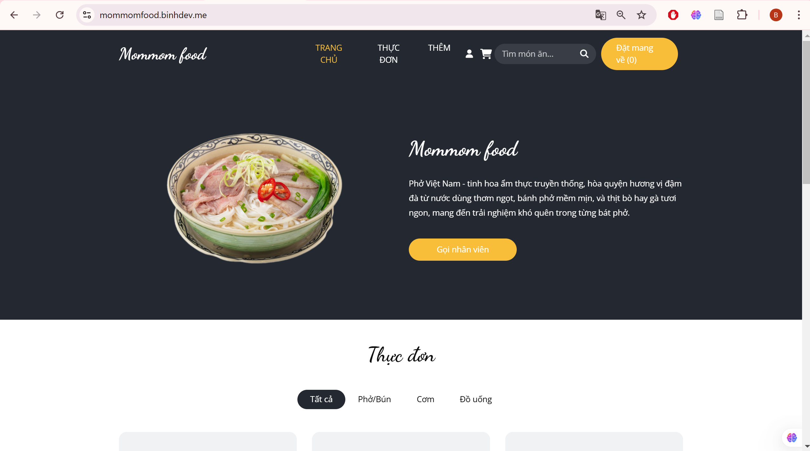
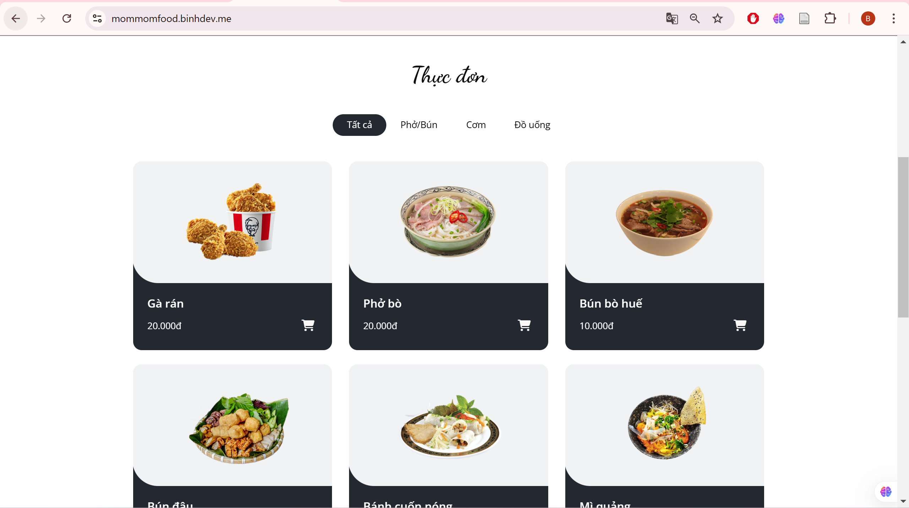
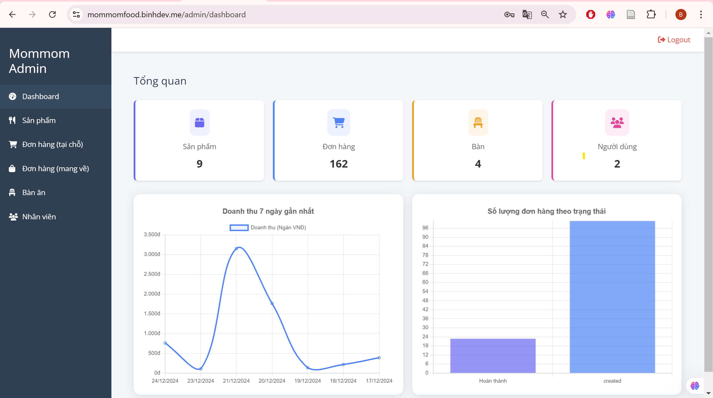

# Mommom_Food: Dự án Order Đồ Ăn

## Địa chỉ Trang Web
[https://mommomfood.binhdev.me/](https://mommomfood.binhdev.me/)

## Tài Khoản Admin
- **Tài khoản:** admin  
- **Mật khẩu:** 1
## Cấu trúc dự án
```
📄 Dockerfile
📄 Procfile
📄 README.md
📄 docker-compose.yml
📄 init.sql
📁 mommom_food
  📄 README.md
  📄 package-lock.json
  📄 package.json
  📁 public
    📁 css
      📄 bootstrap.css
      📄 font-awesome.min.css
      📄 responsive.css
      📄 style.css.map
      📄 style.scss
    📄 favicon.ico
    📁 fonts
      📄 fontawesome-webfont.ttf
      📄 fontawesome-webfont.woff
      📄 fontawesome-webfont.woff2
    📁 images
      📄 about-img.png
      📄 banhcuon.png
      📄 bunbohue.png
      📄 buncha.png
      📄 bundau.png
      📄 client1.jpg
      📄 client2.jpg
      📄 comgaxoimo.png
      📄 comtam.png
      📄 f1.png
      📄 f2.png
      📄 f3.png
      📄 f4.png
      📄 f5.png
      📄 f6.png
      📄 f7.png
      📄 f8.png
      📄 f9.png
      📄 favicon.png
      📄 garan.png
      📄 hero-bg.jpg
      📄 image.png
      📄 miquang.png
      📄 o1.jpg
      📄 o2.jpg
      📄 pho.png
    📄 index.html
    📁 js
      📄 bootstrap.js
      📄 custom.js
      📄 jquery-3.4.1.min.js
    📄 logo1924.png
    📄 logo512.png
    📄 logo5122.png
    📄 manifest.json
    📄 robots.txt
  📁 src
    📁 Admin
      📄 Admin.css
      📄 Admin.js
      📁 components
        📄 AdminHeader.js
        📄 AdminSidebar.js
        📄 TakeawayOrderForm.js
      📁 pages
        📄 Dashboard.js
        📄 Orders.js
        📄 Products.js
        📄 Tables.js
        📄 TakeawayOrders.js
        📄 Users.js
    📄 App.css
    📄 App.js
    📄 App.test.js
    📁 components
      📄 TableRedirect.js
      📁 layout
        📄 Footer.css
        📄 Footer.js
        📄 Header.css
        📄 Header.js
        📄 scripts.css
        📄 scripts.js
      📁 pages
        📄 About.js
        📄 AdminLogin.js
        📄 Home.js
        📄 Menu.js
        📁 styles
          📄 About.css
          📄 AdminLogin.css
          📄 BookTable.css
          📄 Home.css
          📄 Menu.css
    📁 hooks
      📄 useCallStaff.js
    📄 index.css
    📄 index.js
    📄 logo.svg
    📄 reportWebVitals.js
    📄 setupTests.js
📄 package-lock.json
📄 package.json
📁 quan_ly_mommom_food
  📄 Procfile
  📄 app.js
  📁 config
    📄 database.js
  📁 controllers
    📄 categoryController.js
    📄 notifyController.js
    📄 orderController.js
    📄 productController.js
    📄 tableController.js
    📄 takeawayOrderController.js
    📄 userController.js
  📁 middleware
    📄 auth.js
  📁 models
    📄 categoryModel.js
    📄 orderModel.js
    📄 productModel.js
    📄 tableModel.js
    📄 takeawayOrderModel.js
    📄 userModel.js
  📄 package-lock.json
  📄 package.json
  📁 routes
    📄 categoryRoutes.js
    📄 notifyRoutes.js
    📄 orderRoutes.js
    📄 productRoutes.js
    📄 statsRoutes.js
    📄 tableRoutes.js
    📄 takeawayOrderRoutes.js
    📄 userRoutes.js
  📁 utils
    📄 jwt.js
    📄 response.js
📄 readme-hdsd.md
📄 struc.js
📄 style.css 
```
## Giới thiệu
**Mommom_Food** là một nền tảng hỗ trợ các quán ăn nhỏ quản lý đơn hàng một cách tiện lợi và nhanh chóng. Dự án cung cấp một giải pháp hiện đại giúp kết nối khách hàng với các quán ăn thông qua website và ứng dụng di động. Với giao diện thân thiện, dễ sử dụng, Mommom_Food mang đến trải nghiệm tối ưu cho cả người dùng lẫn chủ quán.

Người dùng có thể dễ dàng tìm kiếm, đặt món, và theo dõi đơn hàng của mình trực tuyến. Chủ quán có thể quản lý danh sách món ăn, xử lý đơn hàng, và theo dõi doanh thu một cách hiệu quả.
## Công nghệ sử dụng
**Frontend:** React.js
**Backend:** Node.js theo mô hình MVC
**Cơ sở dữ liệu:** MySQL
## Giao Diện Mommom_Food

### Giao Diện Trang Chủ  


### Giao Diện Đặt Món  


### Giao Diện Quản Lý (Admin)  
